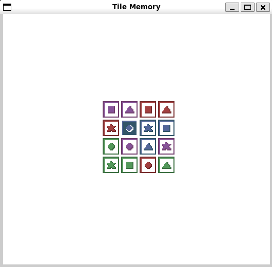

# Tile Memory

Author: Rafael Rivera

Design: Pattern memory game, but tiles are unique and they get shuffled; player repeats tile pattern not spatial pattern.

Screen Shot:

How Your Asset Pipeline Works:

Loads 64 sprites from 8x8 of 8x8 sprites directly from png file. Uses load_png to get pixel data, then formats it row-major ordered, where entry 0 is the top left sprite, and entry 63 is the bottom right. Some shortcuts were taken due to knowing the format, such as assuming there are 4 palettes and that a new palette appears every 2 rows. 

How To Play:

Press middle mouse button to start. The tiles will show a pattern, then shuffle. Select the specific tiles (not their position) as shown initially. Left click to select a tile, right click to unselect a tile, and middle mouse button to submit. If your replication is correct, the board will flash green, otherwise it will flash red.

This game was built with [NEST](NEST.md).

